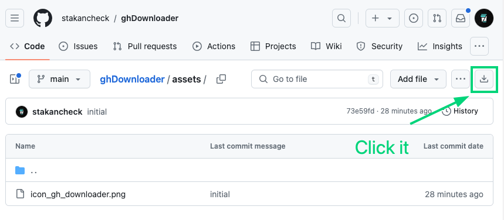

# GitHub Downloader
**GitHub Downloader** is a user script that allows you to download directories and files from GitHub as a ZIP archive.  

### Installation
1. Install the [Tampermonkey](https://www.tampermonkey.net/) extension for your browser.
2. Open the script.js file and copy its content.
3. Open Tampermonkey in your browser and go to "Create a new script".
4. Paste the copied code and save the script.

### Usage
Navigate to the repository, directory, or file page on GitHub. You will see a new "Download ZIP" button. Click on it to download the current directory or file.  

### Known issues
Does not work with private repositories. The bug will be fixed.

### Limitations
The script cannot download private repositories without an access token.
The script cannot download files or directories that exceed GitHub's size limit.

### Special thanks
The script is based on this code
https://github.com/renomureza/downdir

### License
GitHub Downloader is released under the MIT license MIT.
